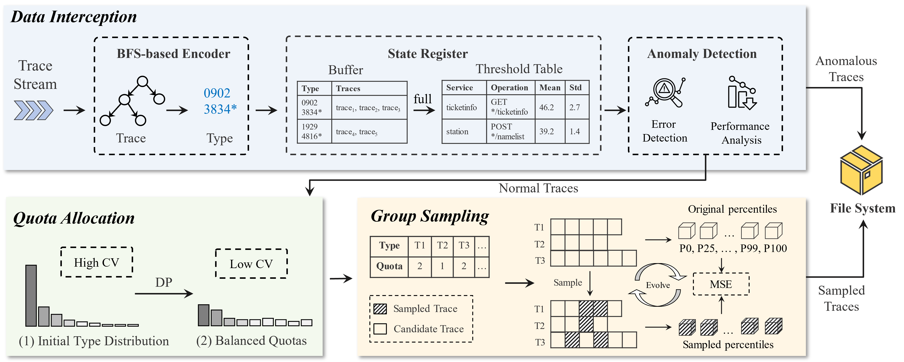

# TracePicker

### TracePicker: Optimization-based Trace Sampling for Microservice-based Systems

TracePicker is an optimization-based online sampler designed to improve the quality of sampled traces while alleviating storage burden. TracePicker incorporates a streaming anomaly detector to enhance the recall of anomalous traces. As for normal traces, TracePicker employs a deferred batch sampling strategy with a fixed-size buffer. To maintain a balanced and comprehensive distribution of trace types within the sampled dataset, TracePicker devises a quota allocation strategy for each type at the beginning of each batch sampling period. TracePicker further implements group sampling for each trace type, approached as a group subset selection problem, thereby enabling the efficient processing of downstream applications.




## Project Structure
```
.
├── core
│   ├── bfsEncoder.py
│   ├── buffer.py
│   ├── pool.py
│   ├── quotaProblemDP.py
│   ├── sampleProblem2.py
│   └── TracePicker.py
├── data
│   ├── A.zip
│   ├── B.zip
│   ├── C.zip
│   ├── onlineBoutique.zip
│   ├── media.zip
│   ├── socialNetwork.zip
│   ├── trainticket.zip
│   └── sockshop.zip
├── entity
│   └── Trace.py
├── helper
│   ├── encode.py
│   ├── func_time.py
│   ├── graph_util.py
│   ├── hist_metric.py
│   ├── tree_util.py
│   ├── scaler.py
│   └── io_util.py
├── eval.py
├── main.py
├── README.md
├── requirements.txt
└── run.sh

```

## Datasets
We evaluated the individual-level performance on three datasets:
- A. The A dataset is derived from the test data (`trace_data/pu_data`) released by the [PUTraceAD](https://github.com/PUTraceAD/PUTraceAD).
- B. The B dataset is derived from the sampling data (`trace_data/tail-based_sampling`) released by the [TraceCRL](https://github.com/FudanSELab/TraceCRL).
- C. The C dataset is derived from the anomaly detection dataset (`trace_data/anomaly_detection`) released by the [TraceCRL](https://github.com/FudanSELab/TraceCRL).

Labeled dataset (A, B, C) consists of 9900 normal traces selected randomly and 100 anomalous traces. The anomalous traces consist of 50 high-latency traces and 50 error traces. Error traces are selected based on the abnormal status code, while high-latency traces labeled as anomalous with normal status code. For the unlabeled traces dataset (D), 10000 traces are randomly sampled.

We evaluated the global-level and sampler-level performance on five benchmarks:
- [Train Ticket](https://github.com/FudanSELab/train-ticket.git)
- [Social Network](https://github.com/delimitrou/DeathStarBench/tree/master/socialNetwork)
- [Online-boutique](https://github.com/GoogleCloudPlatform/microservices-demo)
- [Sock Shop](https://github.com/microservices-demo/microservices-demo)
- [Media](https://github.com/delimitrou/DeathStarBench/tree/master/mediaMicroservices)

## Getting Started

<B>Enviroment configuration</B>
- python==3.8.18
- geatpy==2.7.0
- networkx==3.1
- numpy==1.24.3
- pandas==1.5.3
- scikit_learn==1.0
- scipy==1.10.1
- treelib==1.7.0


<B>Unzip Datasets</B>

You should first decompress the datasets under the `./data` directory
``` python
cd data/
unzip trainticket.zip
...
```
<B>Run</B>

You can directly run the below commands:
``` python
./run.sh
```
The output results can be found in generated `./output/` directory
